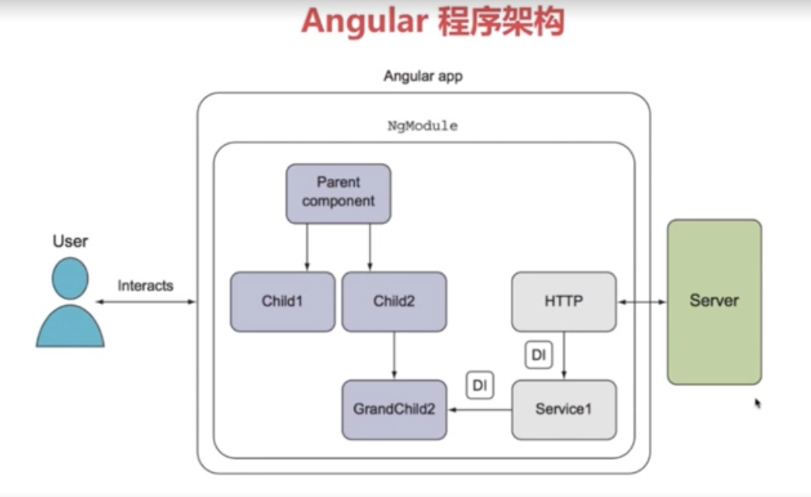

# angular 与其他前端框架的对比

## 与React对比

* 速度:react会先更新虚拟dom,再和实际dom进行对比 angular与之不相上下
* FLUX架构:组件化 数据单向更新
* 服务器端渲染 预渲染 seo优化

## 与vue对比

* 个人主导(angular为google开发,号召力资金充足,vue相对来说有些不足)
* 只关注web(angular还可以开发客户端应用)
* 服务器端渲染(vue通过第三方库,angular有官方库)

## angular程序架构

**组件**:是Angular应用的基本构建块,你可以把一个组件理解为一段带有业务逻辑和数据的html

**服务**:用来封装可重用的业务逻辑

**指令**:允许你向html中添加自定义行为

**模块**:用来将应用中不同的部分组织成一个Angular框架可以理解的单元

**组件、服务、模块是为了完成某些功能的,模块是为了打包、分发这些功能的.**

### 组件

**组件(Component)必备三要素**:

* 装饰器( @Component() ):
* 模版(Template)
* 控制器(Controller)
* 控制器←→控制器进行数据绑定

{{xxx}}:插值表达式

### 启动angular应用

> 1. 启动时加载了哪个页面?
> 1. 启动时加载了哪些脚本?
> 1. 这些脚本做了什么事?

### 如何引用第三方类库(2-5)开发准备

1. npm install 安装到本地库 package.json -> dependencies
2. 引入到项目中 angular6 后在angular.json中在styles/script中分别引入,之前的版本在angular-cli.json中
3. npm install @types/jquery -D 安装jquery的ts类型描述文件,npm i @types/bootstrap -D安装bootstrap的ts类型描述文件

### 组件开发

1. App组件
2. 导航栏组件
3. 页脚组件
4. 搜索表单组件
5. 轮播图组件
6. 商品展示组件
7. 星级评价组件 *ngFor:指令

命令自动生成组件 ng g component xxx 在当前项目下生成组件

### 商品展示组件

重点:**angular始终是根据后台数据的变化来生成页面的,而不是去操纵dom元素**

bootstrap元素居中:
在bootstrap中实现元素居中的方法主要有这几种：

1. 加类.text-center（子元素居中）

2. 加类.center-block（自身居中）

3. 利用bootstrap中列偏移的概念。例如：col-md-offset-2(外边距向右偏移两列)

### 数据绑定

1. 通过插值表达式 {{xxx.xxx}} 直接将对象的属性展示出来
2. 属性绑定: 通过[]将标签属性绑定控制器的属性
3. 样式绑定: [class.glyphicon-star-empty]="star"  前面的class表示的是我后面要绑定的是一个class样式这个样式是由star的值决定的,star为true时会多出这么个样式,反之则不会
4. 属性传递: