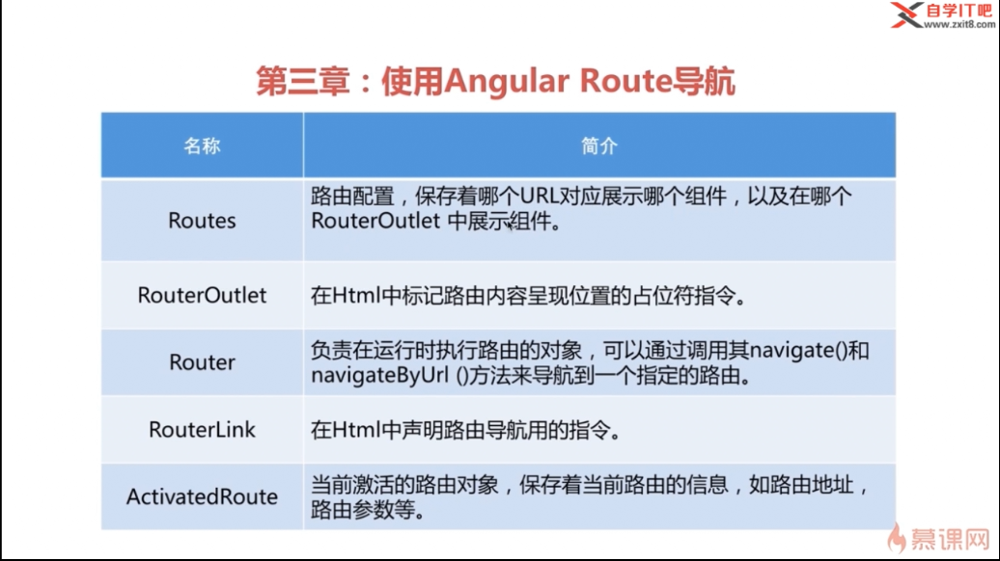
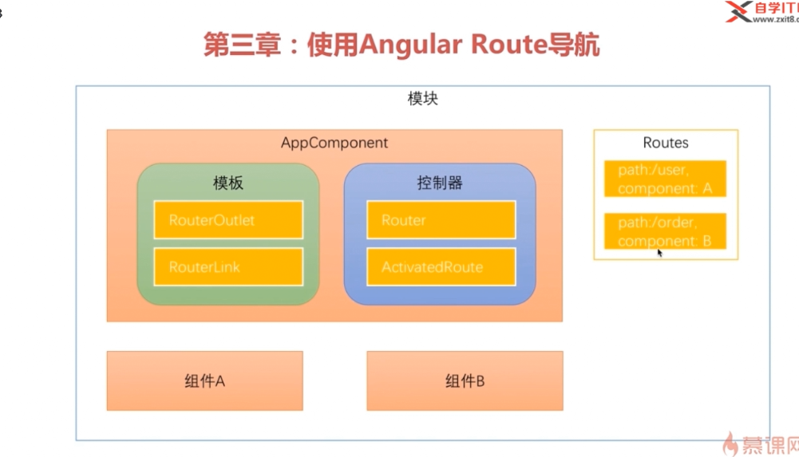

# angular学习

## 1.angular 与其他前端框架的对比

### 与React对比

* 速度:react会先更新虚拟dom,再和实际dom进行对比 angular与之不相上下
* FLUX架构:组件化 数据单向更新
* 服务器端渲染 预渲染 seo优化

### 与vue对比

* 个人主导(angular为google开发,号召力资金充足,vue相对来说有些不足)
* 只关注web(angular还可以开发客户端应用)
* 服务器端渲染(vue通过第三方库,angular有官方库)

### angular程序架构


**组件**:是Angular应用的基本构建块,你可以把一个组件理解为一段带有业务逻辑和数据的html

**服务**:用来封装可重用的业务逻辑

**指令**:允许你向html中添加自定义行为

**模块**:用来将应用中不同的部分组织成一个Angular框架可以理解的单元

**组件、服务、模块是为了完成某些功能的,模块是为了打包、分发这些功能的.**

### 组件

**组件(Component)必备三要素**:

* 装饰器( @Component() ):
* 模版(Template)
* 控制器(Controller)
* 控制器←→控制器进行数据绑定

{{xxx}}:插值表达式

### 启动angular应用

> 1. 启动时加载了哪个页面?
> 1. 启动时加载了哪些脚本?
> 1. 这些脚本做了什么事?

### 如何引用第三方类库(2-5)开发准备

1. npm install 安装到本地库 package.json -> dependencies
2. 引入到项目中 angular6 后在angular.json中在styles/script中分别引入,之前的版本在angular-cli.json中
3. npm install @types/jquery -D 安装jquery的ts类型描述文件,npm i @types/bootstrap -D安装bootstrap的ts类型描述文件

### 组件开发

1. App组件
2. 导航栏组件
3. 页脚组件
4. 搜索表单组件
5. 轮播图组件
6. 商品展示组件
7. 星级评价组件 *ngFor:指令

命令自动生成组件 ng g component xxx 在当前项目下生成组件

### 商品展示组件

重点:**angular始终是根据后台数据的变化来生成页面的,而不是去操纵dom元素**

bootstrap元素居中:
在bootstrap中实现元素居中的方法主要有这几种：

1. 加类.text-center（子元素居中）

2. 加类.center-block（自身居中）

3. 利用bootstrap中列偏移的概念。例如：col-md-offset-2(外边距向右偏移两列)

### 数据绑定

1. 通过插值表达式 {{xxx.xxx}} 直接将对象的属性展示出来
2. 属性绑定: 通过[]将标签属性绑定控制器的属性
3. 样式绑定: [class.glyphicon-star-empty]="star"  前面的class表示的是我后面要绑定的是一个class样式这个样式是由star的值决定的,star为true时会多出这么个样式,反之则不会
4. 属性传递:父组件传递给子组件

```html
 <div>
      <!--将当前rating属性值传到星级评价组件中 父组件传递到子组件-->
      <app-stars [rating]="product.rating"></app-stars>
 </div>
```

```typescript
  // input装饰器
  @Input()
  // 接收产品星级评价传来的数值
  public rating = 0;
```

## 3.Angular Route(路由) 导航

1. 了解路由的基本知识
2. 子路由,保护路由和辅助路由
3. 在项目中添加路由

**SPA(单页应用/单页Web应用:single page web application):**只有一张Web页面的应用，是加载单个HTML 页面并在用户与应用程序交互时动态更新该页面的Web应用程序。

**路由器:**控制整个视图状态的对象

spa:一组视图状态的集合

## 1.路由的基础知识

* 使用命令 ng new router --routing 创建一个新项目





```txt
npm audit fix --force

npm audit 是 npm 6 新增的一个命令，可以允许开发人员分析复杂的代码并查明特定的漏洞。在刚刚发布的 npm 6.1.0 版本中，开发团队对该命令进行了完善。现在可使用 npm audit fix 子命令自动修复检测到的漏洞，而不必再自己进行跟踪和修复。

新版本针对 npm audit 还包括以下改进：

npm audit --json —— 新的子命令，用于以 JSON 格式打印报告

npm install 摘要输出中将包含审计软件包的数量

npm-audit-report@1.2.1 —— 对审计安装和输出格式进行了大幅调整，新格式更加紧凑，更符合 CLI 视觉风格，同时仍然提供所需的重要信息。

此外，npm 6.1.0 同样扩展了 npm init 命令的功能，新增对 git 包的支持，即 npm init <name>。
```

* 使用命令ng g component home/ng g c product

```html
<!-- 在这个插座的下方显示组件内容 -->
<router-outlet></router-outlet>

[routerLink]="['/']"的参数是一个数组,可以传递参数
```

**事件绑定:**

```typescript
(click)="toProductDetails()"
```

**通配符路由:** 配置规则:放在路由配置最下面

```typescript
const routes: Routes = [
  // 路由不应该使用 / 开头,根据Angular的定义避免使用 / 开头可以在路由导航中自由的使用绝对路径和相对路径
  // 路由对象里最少有两个属性,一个是路由对象的路径,一个是路由对象的组件
  {path: '', component: HomeComponent},
  {path: 'product', component: ProductComponent},
  {path: '**', component: Code404Component}
];
```

## 2.在路由时传递数据

1. 在查询参数中传递数据 `/product?id=01&name=tom => ActivatedRoute.queryParams[id]`
2. 在路由路径中传递数据 `{path:/product/:id} => /product/1 => ActivatedRoute.params[id]`
3. 在路由配置中传递数据 `{path:/product, component: ProductComponent, data:[{isProd:true}]}  => ActivatedRoute.data[0][isProd]`

如果在写一个组件的时候确定不会从自身路由到自身,就可以使用参数快照方法来获取路由

```typescript
// 参数订阅 订阅后声明一个匿名函数传进来之后从参数中取出ID赋值给本地的product
// subscribe rxjs的语法
this.routeInfo.params.subscribe((params: Params) => this.productId = params['id']);
```

如果会从自身路由到自身,就使用参数订阅方法

```typescript
// 在路由路径中获取数据:snapshot 参数快照
this.productId = this.routeInfo.snapshot.params['id'];
```

## 3.重定向路由

用户访问一个特定的地址时,将其重定向到另外一个指定的地址

```txt
eg:
www.aaa.com => www.aaa.com/products
www.aaa.com/x => www.aaa.com/y
```

**关键代码:**

```typescript
// 重定向路由
{path: '', redirectTo: '/home', pathMatch: 'full'},
```

## 4.子路由

## 5.辅助路由

## 6.路由守卫

resolve守卫:

在路由路径中传递数需要三步：
1、修改路由配置中的path属性，使其可以携带参数。
以app-routing.module.ts为例：

{path: 'product/:id', component: ProductComponent},          //添加  /:id
2、修改路由连接的参数来传递参数。
以app.component.html为例：

<a [routerLink]="['/product', 1]">商品详情</a>
3、修改获取参数的方式，让它从Url中获取：
只需要把product.component.ts里面的queryParams改为params就可以，像这样：

this.productId = this.routeInfo.snapshot.params['id'];
第三种、在路由配置中传递数据
{path:/product, component: ProductComponent, data:[{isProd: true}]}

==>   ActivitedRoute.data[0][isProd]
使用这种方式传递数据后，在路由的目标组件中，可以通过ActivitedRoute.data[0][isProd]这个方式来获取传递的数据。

## 3.依赖注入

任何一个angular程序都是由组件,指令和一堆彼此依赖的类的集合,每个组件都可以明确的实例化自己的依赖,但是angular提供了一种依赖注入的机制来完成这个工作

1. 什么是依赖注入?使用依赖注入的好处?
2. angular依赖注入的实现:注入器和提供器
3. 注入器的层级关系

* 依赖注入模式要解决的问题

依赖注入:Dependency Injection (DI) 手段:如何实现控制反转
控制反转:Inversion of Control (IOC) 目的:将代码的控制权由内部转移到外部

实现了控制反转模式的框架被称为IOC容器

依赖注入:增强了代码的松耦合和可重用性

提高了可测试性

```ts
var product = new Product();
createShipment(product);
```

* 注入器 `constructor(private productService: ProductSevice){......}`

上面这段代码表示angular的注入器在看到这样一个构造函数声明的时候,会在angular的应用中寻找一个ProductService的实例,如果可以找到该实例,则将其注入到productService对象中,然后就可以直接使用了

* 提供器 `providers: [ProductService]` 等同于 `providers: [{provider: ProductService, useClass: ProductService}]`

`providers: [{provider: ProductService, useClass: AnotherProductService}]`

`providers: [{provider: ProductService, useFactory: () => {...} }]`

provider: 指定了token,这个token就是构造器声明中指定的类型
useClass: 指定实例化的类

* 提供器作用域规则:

  1. 当一个提供器声明在模块中时,他是对所有组件可见的,所有组件都可以注入他
  2. 当一个提供器声明在组件中时,只对声明他的组件及其子组件可见,其他组件不可以注入他
  3. 当声明在模块中的提供器和组件中的提供器有相同的token时,声明在组件中的提供器会覆盖模块中的提供器
  4. 优先将服务提供器声明在模块中,只有在服务必须对其他组件不可见时,才应该将其声明在组件中(少见)

@Component()装饰器继承了@Injection()装饰器

* 工厂提供器

工厂方法创立的对象是一个单例对象,工厂方法只会在创建第一个需要注入的对象时被调用一次,然后在所有需要被注入的实例都是同一个对象

通过deps参数来使用提供器提供的实例 `deps: [LoggerService]`

* 注入器及注入器的层级关系

  > 应用级注入器
  > 主组件注入器
  > 子组件注入器