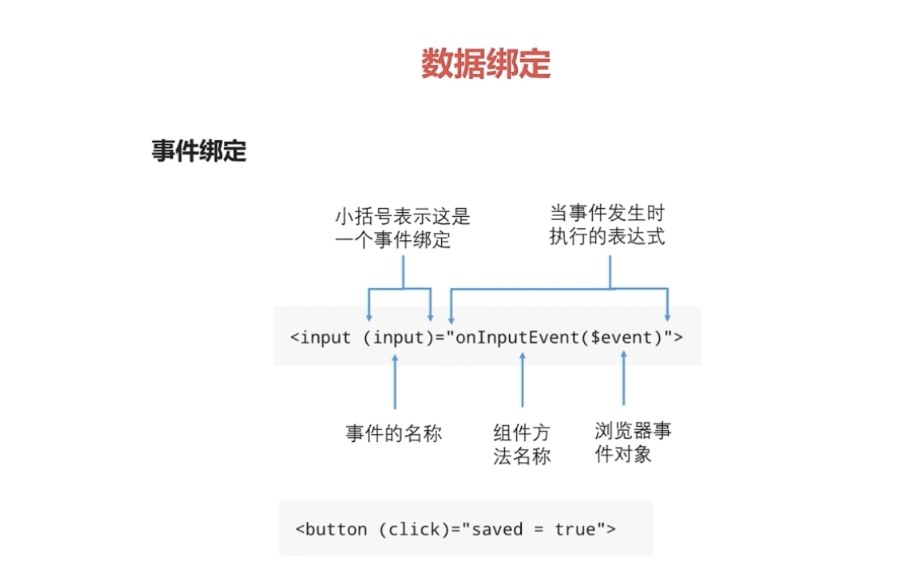
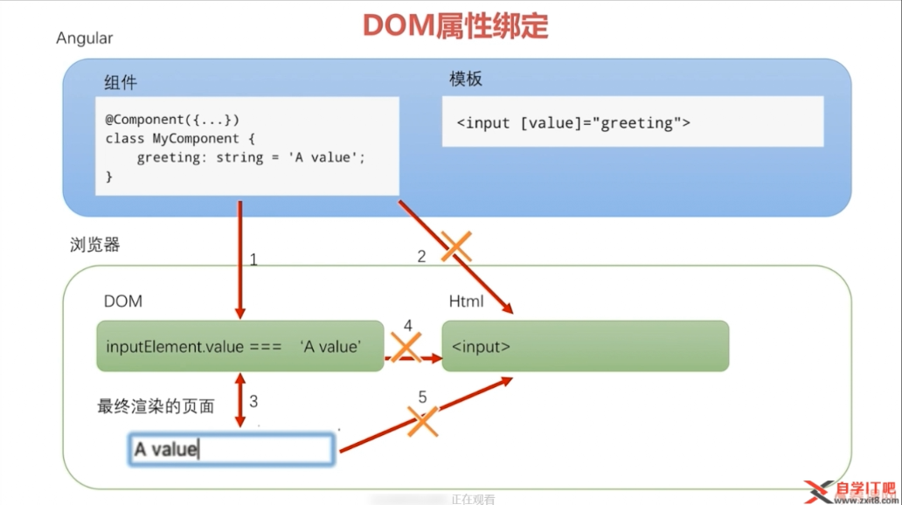
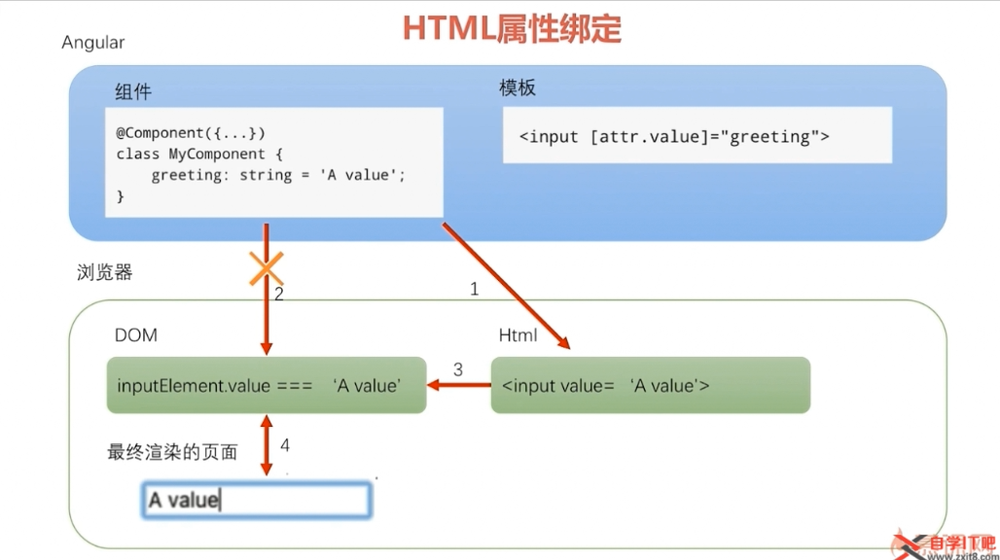

# 数据绑定,响应式编程和管道

1. 数据绑定
2. 响应式编程(rxjs)
3. 管道(格式化模版输出的一种可重用性对象)

## 1.数据绑定

### 1. DOM属性绑定

* 插值表达式 : `<h1>{{productTitle}}!</h1>` 使用插值表达式将一个表达式的值显示在模板上(DOM属性绑定)
* 属性绑定: `` 使用方括号将HTML标签的一个属性绑定到一个表达式上
* 事件绑定: `<button type="button" value="商品详情" (click)="toProductDetails()">商品详情</button>` 使用小括号将组件控制器的一个方法绑定为模板上一个事件的处理器



**HTML属性和DOM属性的关系**:

1. 少量的HTML属性和DOM属性之间有着1:1的映射,如id
2. 有些HTML属性没有对应的DOM属性,如colspan
3. 有些DOM属性没有对应的HTML属性,如textContent
4. 就是名字相同,HTML属性和DOM属性也不是同一样东西
5. HTML属性的值指定了初始值,DOM属性的值表示当前值.DOM属性的值可以改变,HTML属性的值不可以改变
6. 模板绑定是通过DOM属性和事件来工作的,而不是HTML属性



### 2. HTML属性绑定

1. 基本HTML属性绑定 `<td [attr.colspan]="tableColspan">Something</td>`
2. CSS类绑定
    1. `<div class="aaa bbb" [class]="someExpression">Something</div>`
    2. `<div [class.specail]="isSpecail">Something</div>`
    3. `<div [ngClass]="{aaa:isA, bbb:isB}">Something</div>`
3. 样式绑定:
    1. `<div [style.color]="isScepail ? 'red': 'green' ">Red</div>`
    2. `<div [ngStyle]="{'font-style': this.canSave? 'italic':'normal' }">Something</div>`



### 3. 双向绑定

报错: `Angular: Can't bind to 'ngModel' since it isn't a known property of 'input'`
解决办法:

```ts
在你的app.module中添加如下代码即可：

import { FormsModule, ReactiveFormsModule } from '@angular/forms';

@NgModule({
  imports: [
    FormsModule   //此代码仅为需加入的部分，注意比对你本身的代码，把这个加入其中即可
    ]
```