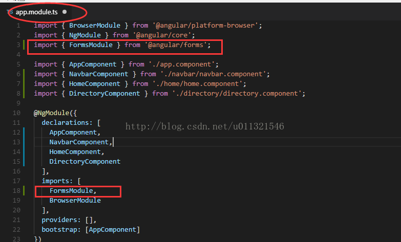
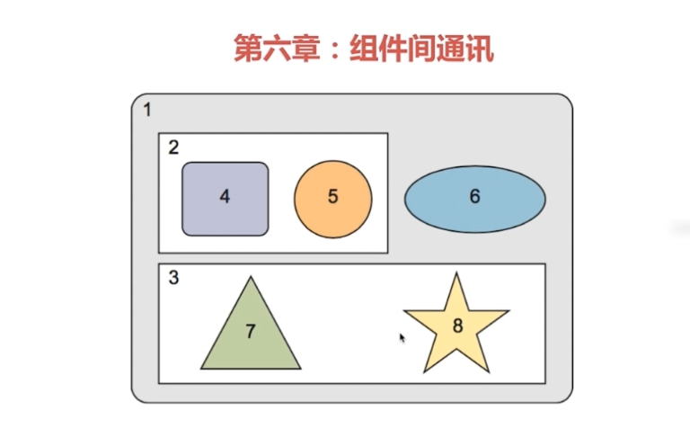
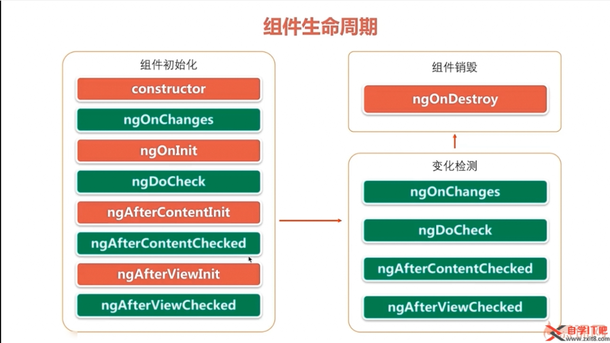
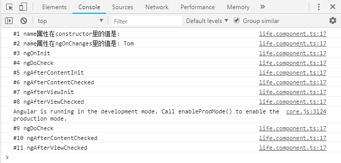
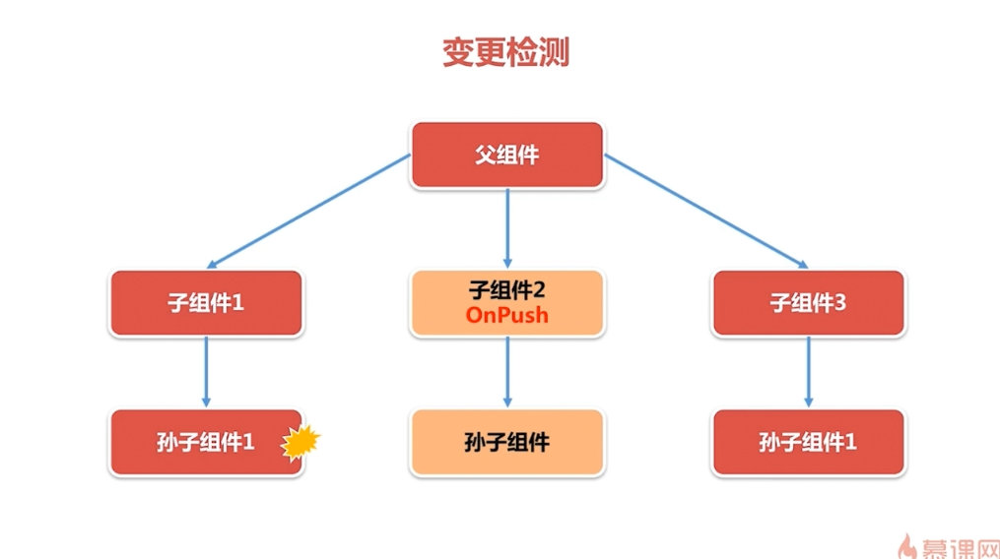
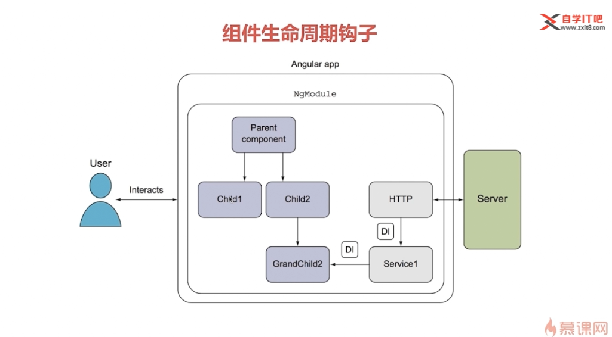

# 组件间通讯

1. 组件的输入输出属性
2. 使用中间人模式传递数据
3. 组件的生命周期以及angular的变化发现机制

## 1. 组件的输入输出属性

输入属性: 绑定是单向的,输入属性父组件的值改变影响子组件的,子组件的值改变的时候无法反过来影响父组件
使用@input装饰器装饰的属性

Angular在 **绑定的源** 和 **绑定的目标** 之间的一个巧妙但重要的区别,关于源和目标的一个简单定义：

> 如果属性出现在了模板表达式等号 (=) 的右侧，它就是一个源。如果它出现在了方括号 ([ ]) 中，并且出现在等号 (=) 的左侧，它就是一个目标**

`<p [prefixHighlight]="color">hover me</p>`

[prefixHighlight]=”color” 中的 ‘color’ 就是绑定源 。 源属性不需要特别声明。 
[prefixHighlight]=”color” 中的 ‘prefixHighlight’ 就是绑定目标。 必须把它定义为一个 Input 属性，否则，Angular 就会拒绝这次绑定，并给出一个明确的错误。

当前只需要记住，通过@Input装饰的输入声明可以确保指令的消费者只能绑定到公开的 API 中的属性，而不是其它的属性。有效的保护了指令或组件的封装性。

```txt
angular2在双向数据绑定时[(ngModel)]无法使用，出现的错误是：

Can't bind to 'ngModel' since it isn't a known property of 'input'.

解决办法：

在文件 app.component.ts 中引入ngModel

具体为：

添加两行代码：

import { FormsModule } from '@angular/forms';

和

FormsModule,

位置如下：
```



## 输出属性

注意: 将特定的数据结构用类或者接口来明确的定义是一个良好的习惯,因为我们在使用ts编程,所以声明类或接口可以让ide帮助做类型检查,和语法提示.

1. 新建一个组件

在控制器里编写代码

```ts
export class PriceQuoteComponent implements OnInit {

  stockCode: string = "IBM";
  price: number;

  /**
   *EventEmitter<?> 既可以发射事件( @Output() ),也可以订阅事件,
   *EventEmitter中泛型的意思是往外发射的事件的数据的类型
   *
   * @type {EventEmitter<PriceQuote>}
   * @memberof PriceQuoteComponent
   */
  @Output('priceChange')
  lastPrice: EventEmitter<PriceQuote> = new EventEmitter();

  constructor() {
    setInterval(() => {
      let priceQuote: PriceQuote = new PriceQuote(this.stockCode, 100 * Math.random());
      this.price = priceQuote.lastPrice;
      //
      this.lastPrice.emit(priceQuote);
    }, 1000);
  }

  ngOnInit() {
  }

}
// 报价对象
export class PriceQuote {
  constructor(
    public stockCode: string,
    public lastPrice: number
  ) { }
}

```

2. 修改模板

```html
<!DOCTYPE html>
<div>
  这里是报价组件
</div>
<div>
  股票代码是{{stockCode}},股票价格是{{price | number:'2.2-2'}}.
</div>
```

3. 修改父组件

```ts
export class AppComponent {
 public stock: string = "";
 public amounts: number;

 // 初始化股票报价对象
 priceQuote: PriceQuote = new PriceQuote("", 0);

 // 事件绑定方法
 priceQuoteHandler(event: PriceQuote) {
  this.priceQuote = event;
 }
}

```

4. 修改父组件模板

```html
<!DOCTYPE html>
<div>
  我是父组件
</div>
<app-price-quote (priceChange)="priceQuoteHandler($event)"></app-price-quote>
<div>
  这是在报价组件外
  <div>
    股票代码是{{priceQuote.stockCode}},
    股票价格是{{priceQuote.lastPrice | number:'2.2-2'}}
  </div>
</div>
```

## 中间人模式



如上图所示:

* 1组件是2,3,6组件的中间人;
* 2组件是4,5组件的中间人;
* 3组件是7,8组件的中间人

**中间人负责从一个组件接收数据,并传递给另外一个组件**.

如果没有中间人组件就应该使用一个中间人服务

## 组件生命周期

下图中展示了所有的组件生命周期钩子,使用这些钩子,可以在组件特定的生命周期发生时执行需要的业务逻辑,图中红色的方法只会被调用一次,绿色的方法会被多次调用.

这些钩子分为三个阶段:

* 组件初始化阶段
* 组件销毁阶段
* 组件变更阶段



在angular中每一个钩子都是@angular/core库里定义的一个接口,每一个接口都有一个唯一的钩子方法,他们的名字是由钩子的名字加上ng前缀构成的

添加接口的好处: IDE的支持,强类型的检查等...



### ngOnChange() 钩子

ngOnChange在父组件初始化或修改子组件的输入参数时调用

可变对象: 在js中, 字符串是不可变的.

```js
var greeting = "Hello";
greeting = "Hello World"; // 改变了内存地址
// 不会去改变原来greeting的值,而是在内存中重新创建了一个greeting,值为hello world
```

不可变对象: 对象可变

```js
var greeting = "Hello";
greeting = "Hello World"; // 内存地址没有改变
// 不会去改变原来greeting的值,而是在内存中重新创建了一个greeting,值为hello world
```

### DoCheck()钩子





注意:

1. ngAfterViewInit在ngAfterViewChecked之前调用
2. 这两个钩子都是在组件的视图组装完毕之后去调用的
3. 如果有子组件,那么只有当所有子组件的ngAfterViewInit和ngAfterViewChecked方法调用完之后才会调用父组件的
4. 不要在这两个方法中去改变视图中需要调用的东西,如果必须要改变可以写在setTimeOut(放在另一个js的运行周期中去运行)里,否则会抛出异常(原因: 在变更周期检测中,angular是禁止在一个视图被组装好之后再去更新这个视图的)

### ngAfterContentInit & ngAfterContentChecked

投影: `<ng-content></ng-content>` 和 `[innerHTML]="divContent"`

ng-content: 只能绑定父组件的内容,有多个投影点 ⭐优先考虑
innerHTML: 只能绑定当前组件的内容

ng-content指令可以将父组件中的任意html模板片段投影到子组件中